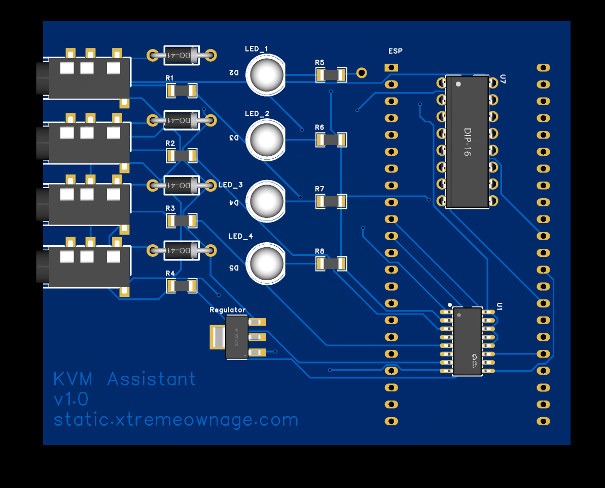
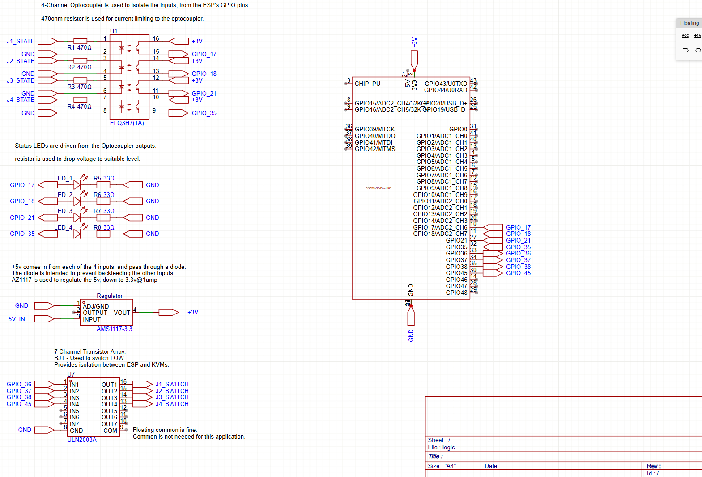

# KVMAssistant

Hardware based solution for home-assistant control over KVMs.

The initial goal of this project is to enable plug and play home assistant control over common off the shelf consumer KVM units.

I have multiple CKL-KVM units to test with, as well as no-name unit, and a TESSMart.

Depending, on how much interest this project gets, depends on how far it goes.

Board was originally built with KiCAD, but, moved to EasyEDA as getting the correct parts was quite a bit easier.

If you wanted to build one, every EXCEPT the ESP will cost.... under 3$.

## Coming soon

Initial schematic design completed. Not perfect, but, good enough to send in an order for PCBs and parts.

Parts were ordered a few weeks ago, pending arrival.

Schematic

